# VUE(& TypeScript)从入门到XX

## 零 · 招兵买马

### 1、简单了解js生活的世界（原生世界和框架之下）

1. **JavaScript组成**  
   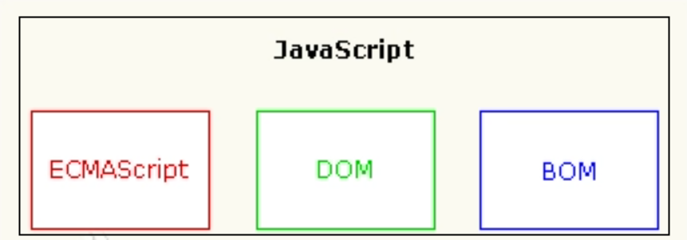  
   + ECMAscript标准作为核心，规定每一版本的JavaScript的功能特性
   + DOM对象提供对页面文档内容（页面元素）的一系列操作API
   + BOM对象则包含对浏览器的诸多操作API  

   >以上内容形成了javascript的“能力”

2. **js的角斗场**  

   >纵使七十二变，难逃天地之间；好马无伯乐，难为千里驹

   + **在浏览器下**，js想要施展拳脚，需要有一个懂他拳法的人——js引擎（比如谷歌浏览器的v8引擎），由js引擎来解释js代码并与渲染引擎交互，渲染动态变化的页面
   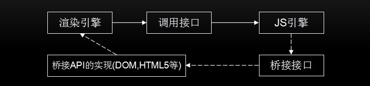  
   &emsp;&emsp;&emsp;&emsp;&emsp;&emsp;&emsp;&emsp;*动态页面如何而来 - 引擎之间的交互*
   + **“跳出三界外”**，巨巨们通过对js引擎的拓展（比如增加文件系统相关功能，增加网络编程相关功能），搞出来了一套javascript的后端运行时——NodeJS，这一套下来，整个应用堆栈可以用一套语言完成，还能轻松跨平台，真香！

### 2、JavaScript是个好战士，应该给他一套“好盔甲”

1. **先看看“轻装上阵”的JavaScript**
   + 不检查变量类型，对类型进项强制转型，可能导致异常  
     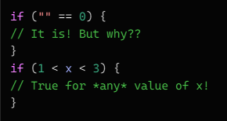  
   + 允许访问不存在的属性  
     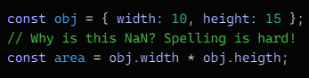  
2. **何谓“好甲”？**

   >大多数编程语言会在发生此类错误时引发错误，有些会在编译期间（在运行任何代码之前）引发错误，某些语言根本不允许那些错误的程序运行。在不运行代码的情况下检测代码中的错误称为**静态检查**。根据要操作的值的种类来确定是什么错误和什么不是错误，这称为**静态类型检查**

   上述内容已经描述了**好盔甲**的特征了
   + 静态检查
   + 静态类型检查
   所以不必把TypeScript当作一个全新的语言，进而产生畏难，`不就是给JavaScript加了个静态类型检查器么？`

   >兵还是那个兵，只是穿了副好盔甲

   如此一来JavaScript显得更加严谨，然而TypeScript提供的并不止这些
   + 对**面向对象编程**理念的更深刻的支持；虽然ES2015/ES6就提供了类的概念，但TypeScript利用自身优势，吸取ES6精华后，丰富了类型、对象实例，使得编写JS更接近编写C++、Java等面向对象语言
   + **模块化编程**（模块的概念也来源于ES6）

   ```none
   要“穿上”TypeScript这副甲，了解这些就差不多（注意多多关注变量类型的问题），但要“穿得好，穿得舒服”，那可远不止这些
   ```

   [上链接！](https://www.typescriptlang.org/docs/handbook/typescript-from-scratch.html)

## 一 · 好兵也要拉出来练

### 1、新式部队——VueJS

  
&emsp;&emsp;&emsp;&emsp;*来一张徽记熟悉熟悉*

>一个好的部队有啥特征？

1. **成了Vue的兵，决对不吃亏（VueJS征兵启示）**  
   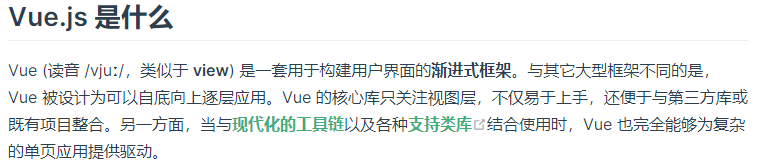  
   + **Vue装备精良：**
     丰富的生态，在[Awesome Vue packages](https://awesomejs.dev/for/vue/)中，可以找到各方各面的基于Vue的包，避免重复造轮
     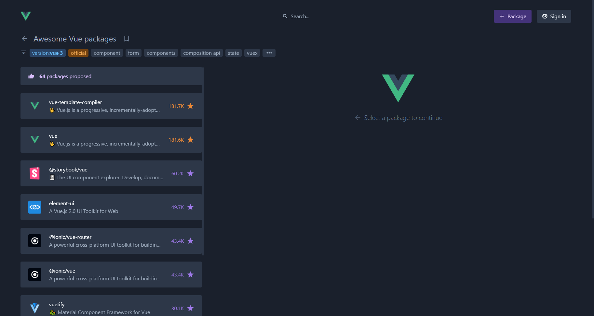  
     &emsp;&emsp;&emsp;&emsp;&emsp;&emsp;&emsp;&emsp;*首页*
     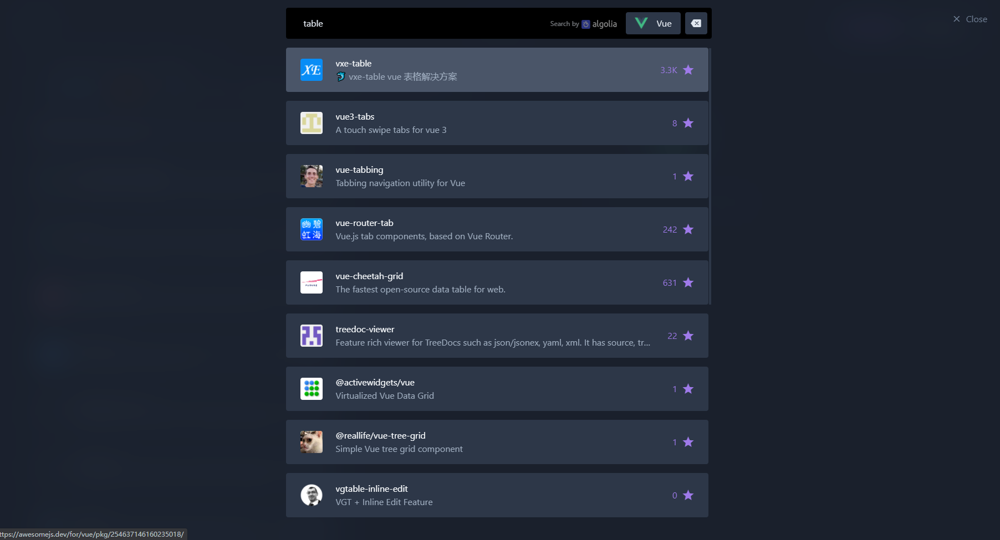  
     &emsp;&emsp;&emsp;&emsp;&emsp;&emsp;&emsp;&emsp;*搜一搜表格相关的包*

     >*“造轮子这方面......造轮子是不可能造轮子的......来Awesome Vue packages的感觉就像回家一样，个个都是好工具，功能又丰富，喔，超喜欢在里面的”*

   + **Vue部队基建好:**
     + ① [vue-cli](https://cli.vuejs.org/zh/guide/)提供交互式的操作，轻而易举地构建一个Vue App
       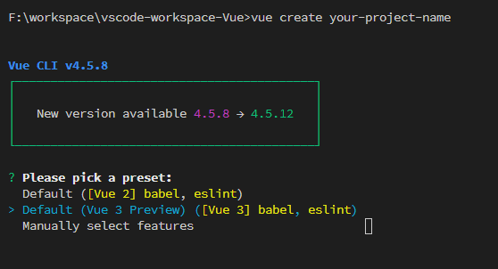  
       &emsp;&emsp;&emsp;&emsp;&emsp;&emsp;&emsp;&emsp;*开始创建*
       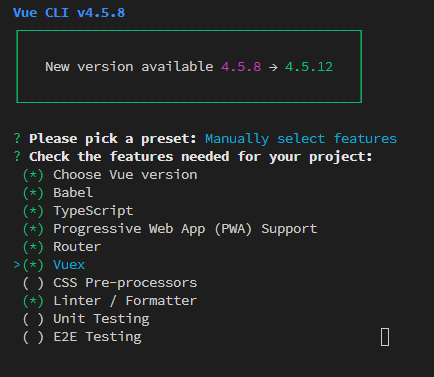  
       &emsp;&emsp;&emsp;&emsp;&emsp;&emsp;&emsp;&emsp;*交互式地添加一些官方组件*
       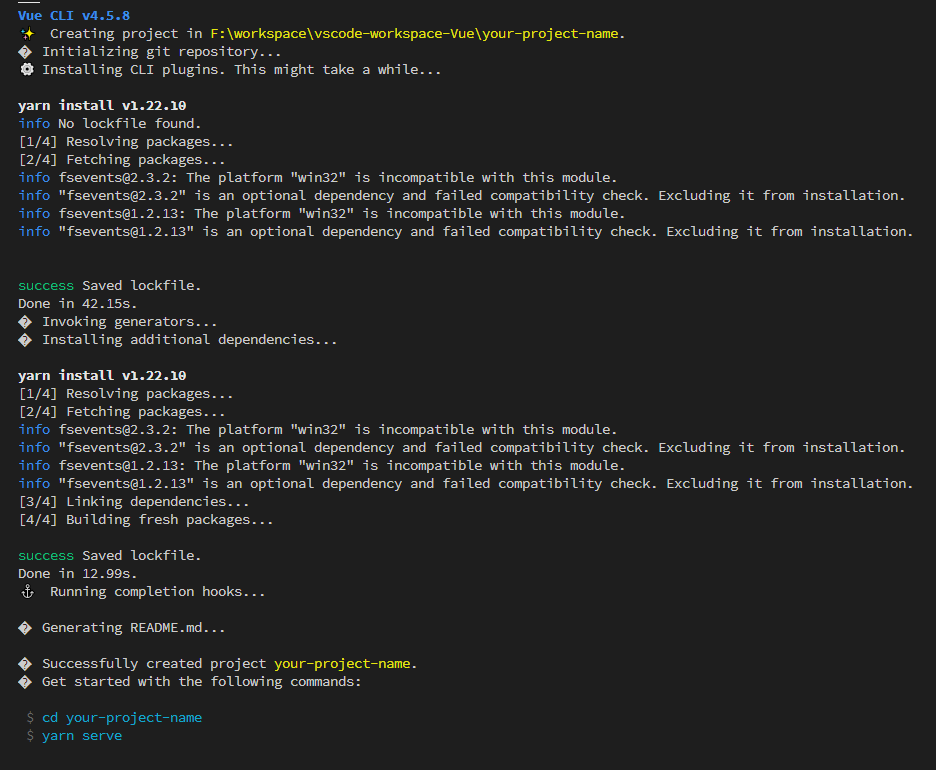  
       &emsp;&emsp;&emsp;&emsp;&emsp;&emsp;&emsp;&emsp;*一问一答轻松配置app相关信息，并生成项目*
       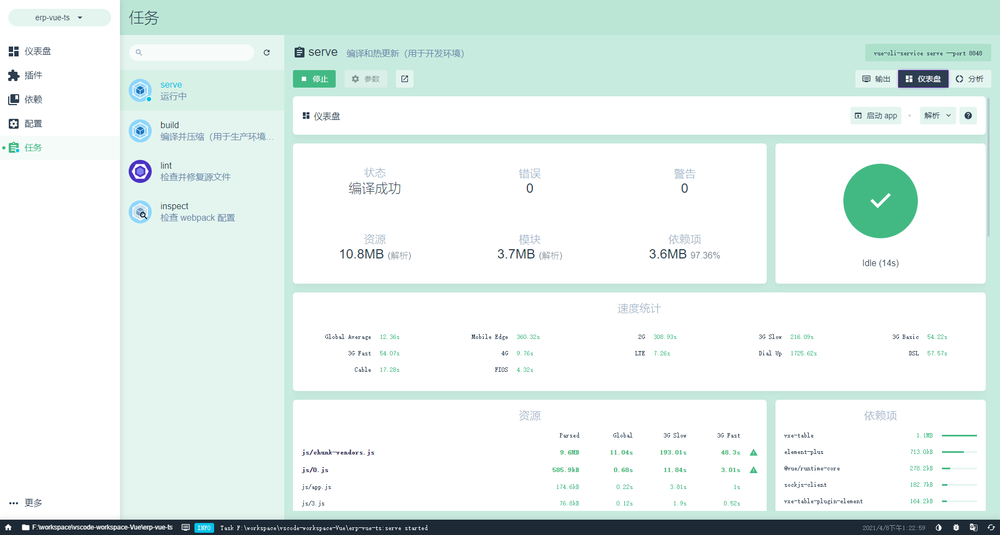  
       &emsp;&emsp;&emsp;&emsp;&emsp;&emsp;&emsp;&emsp;*还可以使用vue ui命令通过ui界面轻松管理&分析应用*
     + ② [Vue Router](https://next.router.vuejs.org/zh/introduction.html)官方组件保驾护航，轻松安全地实现页面路由
   + **部队素质好**  
     VueJS代代演进，现在已经第3代（Vue Next），并且使用vue的库都已做了对应迭代，比如UI库Element-ui演进到Element-Plus（以适配Vue3），vxe-table演进到第4代（Vxe-Table Next），并且Vue3也完全用TypeScript编写，对TypeScript提供了官方支持
2. **进一步了解Vue**

   >这里带一部分项目里的内容作为示例

   + 基础
     + 创建应用、挂载应用⭐⭐  
       vue中，我们使用暴露的全局API——createApp()来创建vue应用实例，该接口可接收两个参数，第一个是一个js对象，用来配置该vue应用实例（即根实例）  
       **举例：**  
       + *在重构项目中采用如下方式创建App实例*  
         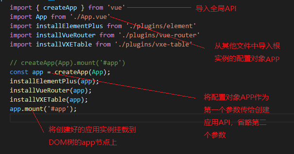
       + *顺便看一下配置对象App*  
         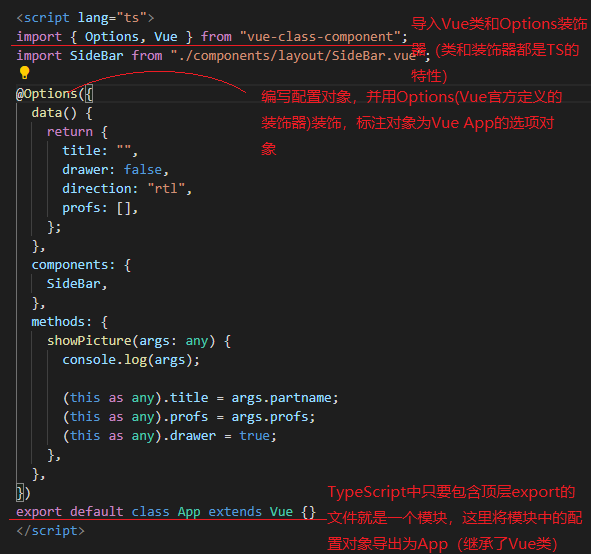
     + 创建组件⭐⭐  
       + *项目中普遍这样创建组件，编写好组件的配置对象后导出*  
         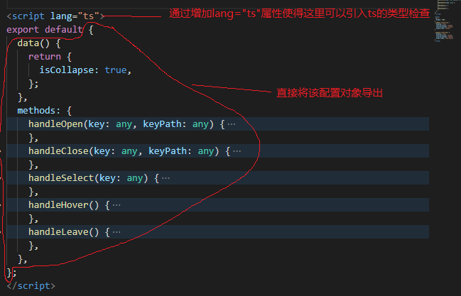
       + *在App中导入并注册组件*
         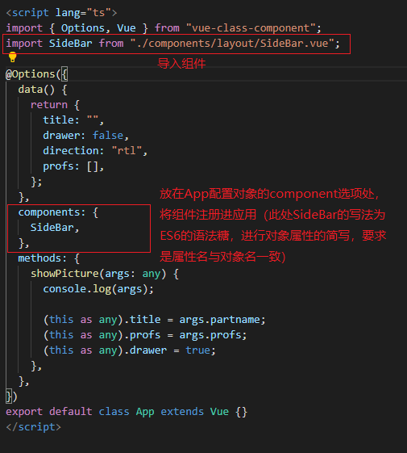
     + 实例property、Data proprety⭐⭐  
       Vue.js 的核心是一个允许采用简洁的模板语法来声明式地将数据渲染进 DOM 的系统  
       组件的 data 选项是一个函数。Vue 在创建新组件实例的过程中调用此函数。它应该返回一个对象，然后 Vue 会通过响应性系统将其包裹起来，并以 $data 的形式存储在组件实例中  
       在data选项的函数中返回的数据都会被vue包裹为响应式的，所以能动态地渲染在实例中（在视图上看到）如创建组件中图1里的isCollapse参数可以被组件读到其值并利用  
       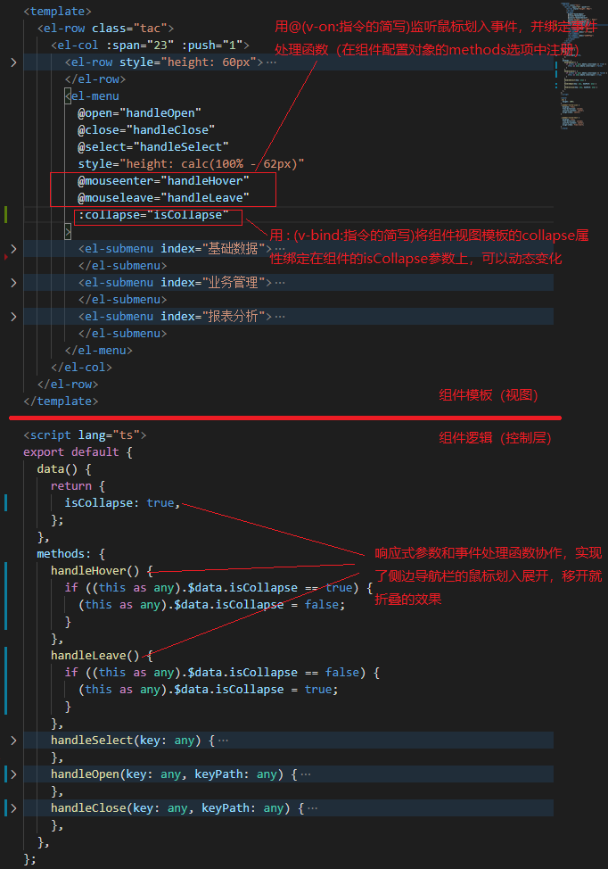
     + 生命周期⭐⭐⭐  
     + 模板语法，绑定数据（尤其要讲Attribute）⭐  
     + 指令和指令缩写⭐⭐  
     + 响应变化（计算/侦听属性、方法、侦听器）⭐  
     + 条件渲染、列表渲染（简单带过）  
     + 事件处理⭐⭐⭐（监听、处理方法、内联处理、多处理、修饰符、键盘鼠标修饰符）  
     + 数据双向绑定（修饰符）⭐⭐⭐  
   + 组件精讲（创建&注册、数据传递（props单向下行））辅助理解UI库组件和表格库组件  
     + 自定义事件⭐⭐  
     + 插槽(具名插槽及其缩写)⭐⭐  
     + keep-alive  
     + 模板引用⭐⭐⭐  
   + 组合式API  
     + setup()⭐⭐⭐  
     + ref响应式变量⭐⭐⭐  
     + toRefs解构响应式对象，获取响应式属性  
     + 生命周期钩子相关函数  
     + 侦听  
     + 计算属性  
     + toRef创建props中可选参数的引用  

### 2、部队集结——认识Element-Plus、Vxe-Table

1. **Element-Plus**

   >网站快速成型工具  

    Element Plus，一套为开发者、设计师和产品经理准备的基于 Vue 3.0 的桌面端组件库
   + 使用Element有多种途径
     + 可以直接使用Element-Plus提供的[项目模块](https://github.com/element-plus/element-plus-starter)，快速着手开发
     + 或者通过vue-cli创建项目后添加Element-Plus插件（Element官方为新版的 vue-cli 准备了相应的 [Element Plus](https://github.com/element-plus/vue-cli-plugin-element-plus) 插件，你可以用它们快速地搭建一个基于 Element Plus 的项目。）

## 二 · 项目意识

### 1、项目结构

### 2、工具选型

### 3、实施步骤（开发，调试，部署）

### 4、Freq BugFix
