# VUE(& TypeScript)从入门到XX

## 零 · 招兵买马

### 1、简单了解js生活的世界（原生世界和框架之下）

1. **JavaScript组成**  
     
   + ECMAscript标准作为核心，规定每一版本的JavaScript的功能特性
   + DOM对象提供对页面文档内容（页面元素）的一系列操作API
   + BOM对象则包含对浏览器的诸多操作API  

   >以上内容形成了javascript的“能力”

2. **js的角斗场**  

   >纵使七十二变，难逃天地之间；好马无伯乐，难为千里驹

   + **在浏览器下**，js想要施展拳脚，需要有一个懂他拳法的人——js引擎（比如谷歌浏览器的v8引擎），由js引擎来解释js代码并与渲染引擎交互，渲染动态变化的页面
     
   &emsp;&emsp;&emsp;&emsp;&emsp;&emsp;&emsp;&emsp;*动态页面如何而来 - 引擎之间的交互*
   + **“跳出三界外”**，巨巨们通过对js引擎的拓展（比如增加文件系统相关功能，增加网络编程相关功能），搞出来了一套javascript的后端运行时——NodeJS，这一套下来，整个应用堆栈可以用一套语言完成，还能轻松跨平台，真香！

### 2、JavaScript是个好战士，应该给他一套“好盔甲”

1. **先看看“轻装上阵”的JavaScript**
   + 不检查变量类型，对类型进项强制转型，可能导致异常  
       
   + 允许访问不存在的属性  
       
2. **何谓“好甲”？**

   >大多数编程语言会在发生此类错误时引发错误，有些会在编译期间（在运行任何代码之前）引发错误，某些语言根本不允许那些错误的程序运行。在不运行代码的情况下检测代码中的错误称为**静态检查**。根据要操作的值的种类来确定是什么错误和什么不是错误，这称为**静态类型检查**

   上述内容已经描述了**好盔甲**的特征了
   + 静态检查
   + 静态类型检查
   所以不必把TypeScript当作一个全新的语言，进而产生畏难，`不就是给JavaScript加了个静态类型检查器么？`

   >兵还是那个兵，只是穿了副好盔甲

   如此一来JavaScript显得更加严谨，然而TypeScript提供的并不止这些
   + 对**面向对象编程**理念的更深刻的支持；虽然ES2015/ES6就提供了类的概念，但TypeScript利用自身优势，吸取ES6精华后，丰富了类型、对象实例，使得编写JS更接近编写C++、Java等面向对象语言
   + **模块化编程**（模块的概念也来源于ES6）

   ```none
   要“穿上”TypeScript这副甲，了解这些就差不多（注意多多关注变量类型的问题），但要“穿得好，穿得舒服”，那可远不止这些
   ```

   [上链接！](https://www.typescriptlang.org/docs/handbook/typescript-from-scratch.html)

## 一 · 好兵也要拉出来练

### 1、新式部队——VueJS

  
&emsp;&emsp;&emsp;&emsp;*来一张徽记熟悉熟悉*

>一个好的部队有啥特征？

1. **成了Vue的兵，决对不吃亏（VueJS征兵启示）**  
     
   + **Vue装备精良：**
     丰富的生态，在[Awesome Vue packages](https://awesomejs.dev/for/vue/)中，可以找到各方各面的基于Vue的包，避免重复造轮
       
     &emsp;&emsp;&emsp;&emsp;&emsp;&emsp;&emsp;&emsp;*首页*
       
     &emsp;&emsp;&emsp;&emsp;&emsp;&emsp;&emsp;&emsp;*搜一搜表格相关的包*

     >*“造轮子这方面......造轮子是不可能造轮子的......来Awesome Vue packages的感觉就像回家一样，个个都是好工具，功能又丰富，喔，超喜欢在里面的”*

   + **Vue部队基建好:**
     + ① [vue-cli](https://cli.vuejs.org/zh/guide/)提供交互式的操作，轻而易举地构建一个Vue App
         
       &emsp;&emsp;&emsp;&emsp;&emsp;&emsp;&emsp;&emsp;*开始创建*
         
       &emsp;&emsp;&emsp;&emsp;&emsp;&emsp;&emsp;&emsp;*交互式地添加一些官方组件*
         
       &emsp;&emsp;&emsp;&emsp;&emsp;&emsp;&emsp;&emsp;*一问一答轻松配置app相关信息，并生成项目*
         
       &emsp;&emsp;&emsp;&emsp;&emsp;&emsp;&emsp;&emsp;*还可以使用vue ui命令通过ui界面轻松管理&分析应用*
     + ② [Vue Router](https://next.router.vuejs.org/zh/introduction.html)官方组件保驾护航，轻松安全地实现页面路由
   + **部队素质好**  
     VueJS代代演进，现在已经第3代（Vue Next），并且使用vue的库都已做了对应迭代，比如UI库Element-ui演进到Element-Plus（以适配Vue3），vxe-table演进到第4代（Vxe-Table Next），并且Vue3也完全用TypeScript编写，对TypeScript提供了官方支持
2. **进一步了解Vue**

   >这里带一部分项目里的内容作为示例

   + 基础
     + 创建应用、挂载应用⭐⭐  
       vue中，我们使用暴露的全局API——createApp()来创建vue应用实例，该接口可接收两个参数，第一个是一个js对象，用来配置该vue应用实例（即根实例）  
       **举例：**  
       + *在重构项目中采用如下方式创建App实例*  
         
       + *顺便看一下配置对象App*  
         
     + 创建组件⭐⭐  
       + *项目中普遍这样创建组件，编写好组件的配置对象后导出*  
         
       + *在App中导入并注册组件*
         
     + 实例property、Data proprety⭐⭐  
       Vue.js 的核心是一个允许采用简洁的模板语法来声明式地将数据渲染进 DOM 的系统  
       组件的 data 选项是一个函数。Vue 在创建新组件实例的过程中调用此函数。它应该返回一个对象，然后 Vue 会通过响应性系统将其包裹起来，并以 $data 的形式存储在组件实例中  
       在data选项的函数中返回的数据都会被vue包裹为响应式的，所以能动态地渲染在实例中（在视图上看到）如创建组件中图1里的isCollapse参数可以被组件读到其值并利用  
       
     + 生命周期  
       
     + 模板语法，绑定数据（尤其要讲Attribute）⭐  
       Vue.js 使用了**基于 HTML** 的模板语法，允许开发者声明式地将 DOM 绑定至底层组件实例的数据。所有 Vue.js 的模板都是合法的 HTML，所以能被遵循规范的浏览器和 HTML 解析器解析。  
       在底层的实现上，Vue 将模板编译成**虚拟 DOM 渲染函数**。结合响应性系统，Vue 能够智能地计算出最少需要重新渲染多少组件，并把 DOM 操作次数减到最少。
       + 最简单，最基础的数据绑定形式就是在模板中通过**Mustache（双大括号）语法**进行文本插值的绑定（项目中基本没有，多数都是第三方包中进行的实现），给个官方示例
         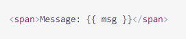  
         上图通过一个双大括号语法将变量msg绑定到DOM中
       + 但更多的情况项目，项目里要求将一些变量绑定到HTML元素的attribute上，继而控制元素表达出想要的形式，这时Mustache语法不在起作用，而vue则提供了v-bind指令来将元素attribute和实例变量绑定，简单实例如下：  
           
         + 第一处，v-bind是vue指令，: 分隔符后的是html元素的attribute，= 后的表达式就是src attribute要绑定的实例变量名字，如此一来，这个img元素的图片地址可以在控制层灵活调整了
         + 第二处，v-bind指令简写为 :
         + 看一个批量绑定的例子，也是项目里比较常见的形式  
           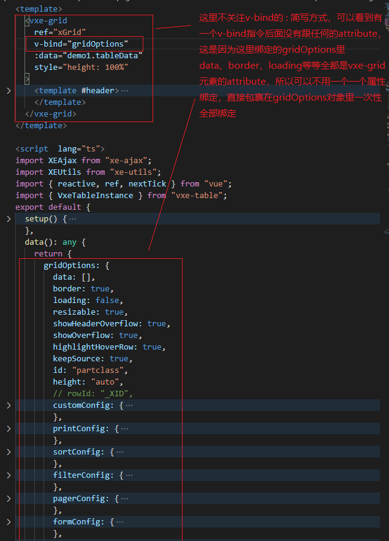
     + 指令和指令缩写⭐⭐  
       上一部分已经讲了v-bind绑定指令，及其简写和批量，vue中还有许多指令，如下是一些项目中使用较频繁的  
       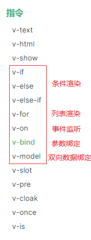  
       + 项目中的列表渲染  
         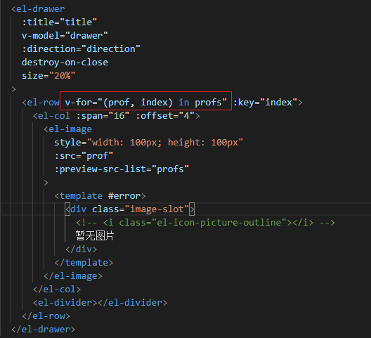  
         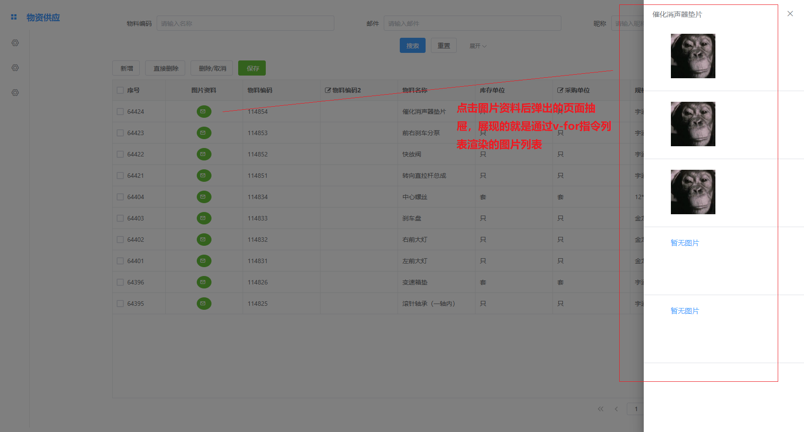  
       + 事件监听  
         形式是 v-on:事件名="处理回调"  
         可以简写成 @事件名="处理回调"，在项目中简写形式比较常见
       + v-model双向绑定
         常用来在表单控件或者组件上创建双向绑定，贴出官方的讲解  
         [表单控件绑定](https://v3.cn.vuejs.org/guide/forms.html)  
         [组件 - 在输入组件上使用自定义事件](https://v3.cn.vuejs.org/guide/component-custom-events.html#v-model-%E5%8F%82%E6%95%B0)
     + 响应变化（计算/侦听属性、方法、侦听器）⭐  
       + 计算属性  
         碰到任何包含响应式数据的复杂逻辑，都可以使用计算属性渲染在DOM上  
         计算属性是放在组件computed选项对象中的一个函数成员（通常直接简写成函数形式），具有缓存效果
       + 方法  
         在组件method选项对象中添加的函数对象就是属于该实例的方法，通常用来作为事件监听的处理回调
       + 侦听器  
         放在实例的watch选项对象中  
         计算属性和侦听器都是用来处理响应式的数据，但当需要在数据变化时执行异步或开销较大的操作时，侦听器则更适合，但是！抛开侦听器的使用场景，计算属性比侦听器更应该广泛使用
     + 条件渲染、列表渲染（简单带过）  
     + 事件处理补述  
       在前面已经知道通过 v-on 指令或他的 @ 缩写可以在组件上监听事件，在实例的method选项中注册的函数可以作为事件处理回调。  
       官方提供了一些时间修饰符来对DOM事件进行处理，让开发者主要处理事件响应逻辑，比如  
       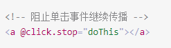  
       除此之外还提供了一些[键鼠系统相关的修饰符](https://v3.cn.vuejs.org/guide/events.html#%E5%86%85%E8%81%94%E5%A4%84%E7%90%86%E5%99%A8%E4%B8%AD%E7%9A%84%E6%96%B9%E6%B3%95)  
   + 组件精讲（创建&注册、数据传递（props单向下行））辅助理解UI库组件和表格库组件  
     + 自定义事件⭐⭐  
       通过自定义组件，可以摆脱元素原生事件、和框架事件的限制，使交互的形式更丰富  
       项目中如下:  
       + 先在子组件vxe-grid中触发show-picture事件  
         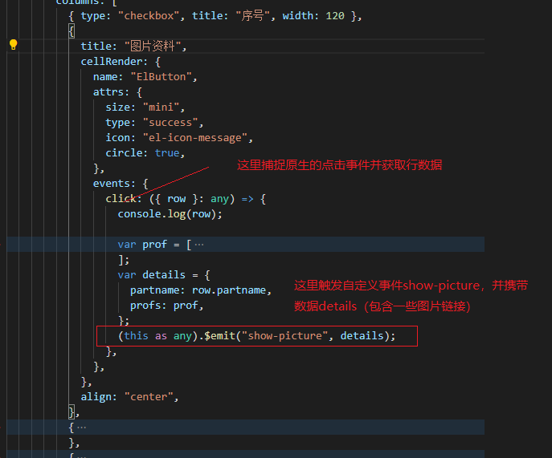  
       + 然后再父组件中捕捉，并获取数据进行利用  
         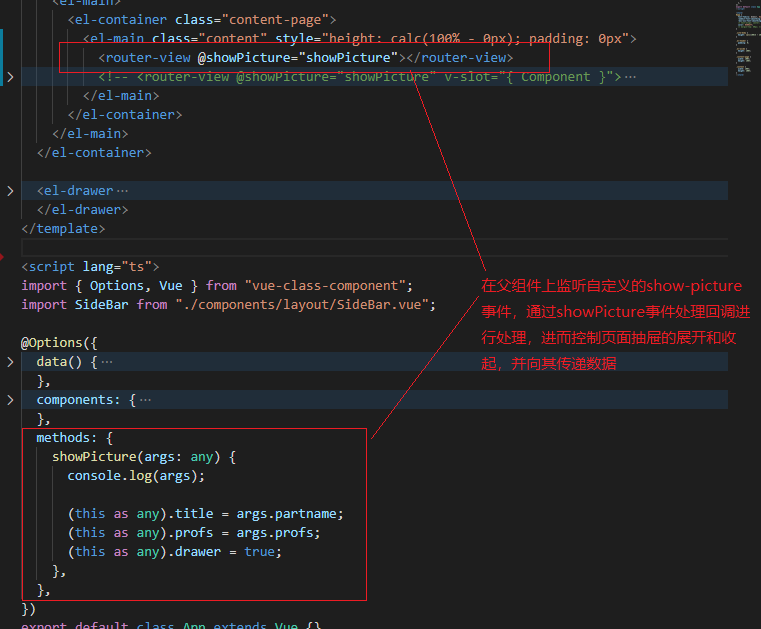
     + 插槽(具名插槽及其缩写)  
       插槽，在vue这个组件式编程的环境下很常见，各个自定义组件的组合使用slot实现地更加便捷轻松，不过项目中直接定义插槽的场景很少，一般都是选择利用第三方组件库中定义好的更规范优雅的形式，其中最为广泛采用的是具名插槽，看一个vue官方的例子  
       + 定义具名插槽(该部分暴露一个名为base-layout的自定义组件)  
         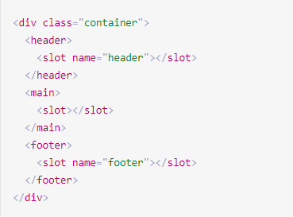

         >项目中并不会出现这种形式，因为第三方库，比如Element-Plus和Vxe-table已经定义了不少实用的插槽

       + 使用具名插槽（在base-layout组件中写入template，利用v-slot指令将内容插入定义好的具名插槽的位置）  
         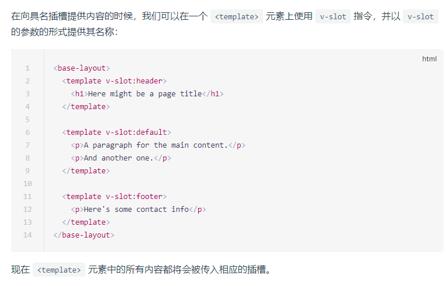  

         >这种形式在项目中则会比较常见，就是再利用第三方提供的一些具名插槽

       + 具名插槽的缩写形式（尤为注意，项目里大多时候都采用缩写）  

         ```html
         <base-layout>
           <template #header> <!-- # 即 v-slot: 的缩写形式-->
             <h1>Here might be a page title</h1>
           </template>

           <template #default>
             <p>A paragraph for the main content.</p>
             <p>And another one.</p>
           </template>

           <template #footer>
             <p>Here's some contact info</p>
           </template>
         </base-layout>
         ```

     + keep-alive  
       对某些有动态数据具有渲染消耗的动态组件可以包裹一层\<keep-alive>\</keep-alive>组件进行保活，可以节省页面切换后重渲染带来的损耗，优化用户体验  
       比如：前一个tab页浏览到的位置，进行tab页切换后，还需要在当前位置，不能因为重渲染而丢失之前的浏览状态
     + 模板引用⭐⭐⭐  
       可以使用 ref attribute 为子组件或 HTML 元素指定引用 ID

       ```html
       <input ref="input" />
       ```

       项目中是下面这种用法(script中即渲染上下文中导出响应式变量root给模板使用，模板通过ref attribute 使用 root，这时root变量就相当于是div元素的响应式引用了)  

       ```html
       <template> 
         <div ref="root">This is a root element</div>
       </template>

       <script>
         import { ref, onMounted } from 'vue'

         export default {
           setup() {
             const root = ref(null)

             onMounted(() => {
               // DOM元素将在初始渲染后分配给ref
               console.log(root.value) // <div>这是根元素</div>
             })

             return {
               root
             }
           }
         }
       </script>
       ```

       项目中的例子  
       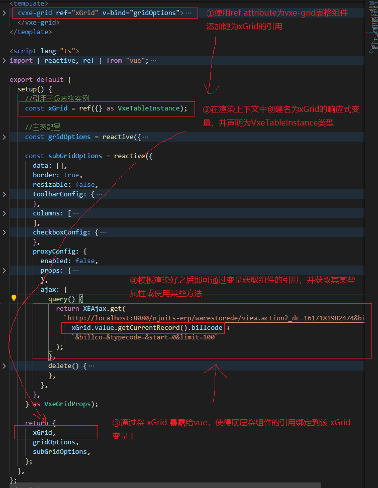  

   + [组合式API](https://v3.cn.vuejs.org/guide/composition-api-introduction.html#%E4%BB%80%E4%B9%88%E6%98%AF%E7%BB%84%E5%90%88%E5%BC%8F-api)
     使用组合式API的目的是整理、重用、共享代码，并且减少单文件组件的体积，将公用的逻辑或配置提取到公共的文件中，各组件以导入的方式重新组织使用。  
     + setup()⭐⭐⭐
       setup选项就是组合式API的入口，使用时间节点是创建组件之前，所以this关键字在这里不可用  
       项目中不乏对setup选项的使用，但还没真正实现组合式API的意义，代码重用较少，改进方式建议参考[官方案例](https://v3.cn.vuejs.org/guide/composition-api-introduction.html#setup-%E7%BB%84%E4%BB%B6%E9%80%89%E9%A1%B9)，逐渐将可重用代码提取到共用文件中
     + ref响应式变量⭐⭐⭐  
       前面的例子中已经通过 ref 创建过响应式变量，这里做讲解
       ref 接受参数，并将其包裹在一个带有 value property 的对象中返回，然后可以使用该 property（value） 访问或更改响应式变量的值  
       但是，从 setup 返回的 refs 在模板中访问时是被自动解开的，因此不应在模板中使用 .value  
     + toRefs解构响应式对象，获取响应式属性  
       setup选项是可以接受两个参数的，其中一个是props，是响应式的，那想要解构props，使用其中的属性，同时又要维护props的响应性，就需要使用vue提供的toRefs  

       ```js
       import { toRefs } from 'vue'

       setup(props) {
         const { title } = toRefs(props)
         console.log(title.value)
       }
       ```

       另外，如果要使用props中某个可选属性（即不一定会存在），那用该使用toRef来代替  

       ```js
       import { toRef } from 'vue'
       setup(props) {
         const title = toRef(props, 'title')
         console.log(title.value)
       }
       ```

     + 生命周期钩子相关函数  
       通过vue暴露的一系列生命周期钩子函数，可以在setup配置某个生命周期的任务逻辑

       ```js
       export default {
         setup() {
           // mounted初次渲染时要进行的逻辑
           onMounted(() => {
             console.log('Component is mounted!')
           })
         }
       }
       ```

     + 计算属性&侦听  
       同理计算属性和侦听器也可以通过vue暴露的函数在组合式API中使用（通常是写在组件的选项property中）  
       函数分别是[computed](https://v3.cn.vuejs.org/api/computed-watch-api.html#computed)和[watch](https://v3.cn.vuejs.org/api/computed-watch-api.html#watch)  

   >至此，要上手该vue项目，所需要的vue知识都已经具备了，接下来需要了解项目所使用的两大部件

### 2、部队集结——认识Element-Plus、Vxe-Table

1. **[Element-Plus](https://element-plus.gitee.io/#/zh-CN/component/installation)**

   >网站快速成型工具  

    Element Plus，一套为开发者、设计师和产品经理准备的基于 Vue 3.0 的桌面端组件库
   + 使用Element有多种途径
     + 可以直接使用Element-Plus提供的[项目模块](https://github.com/element-plus/element-plus-starter)，快速着手开发
     + 或者通过vue-cli创建项目后添加Element-Plus插件（Element官方为新版的 vue-cli 准备了相应的 [Element Plus](https://github.com/element-plus/vue-cli-plugin-element-plus) 插件，你可以用它们快速地搭建一个基于 Element Plus 的项目。）

2. **[Vxe-Table](https://xuliangzhan_admin.gitee.io/vxe-table/v4/table/grid/fullEdit)**

   >一个基于 vue 的 PC 端表格组件，支持增删改查、虚拟滚动、懒加载、快捷菜单、数据校验、树形结构、打印导出、表单渲染、数据分页、虚拟列表、模态窗口、自定义模板、渲染器、贼灵活的配置项、扩展接口等...

3. **粘合剂——[vxe-table-plugin-element](https://github.com/x-extends/vxe-table-plugin-element)**

## 二 · 项目意识

### 1、项目结构

### 2、工具选型

### 3、实施步骤（开发，调试，部署）

### 4、Freq BugFix
