# VUE(& TypeScript)从入门到XX

## 零 · 招兵买马

### 1、简单了解js生活的世界（原生世界和框架之下）

1. **JavaScript组成**  
     
   + ECMAscript标准作为核心，规定每一版本的JavaScript的功能特性
   + DOM对象提供对页面文档内容（页面元素）的一系列操作API
   + BOM对象则包含对浏览器的诸多操作API  

   >以上内容形成了javascript的“能力”

2. **js的角斗场**  

   >纵使七十二变，难逃天地之间；好马无伯乐，难为千里驹

   + **在浏览器下**，js想要施展拳脚，需要有一个懂他拳法的人——js引擎（比如谷歌浏览器的v8引擎），由js引擎来解释js代码并与渲染引擎交互，渲染动态变化的页面
     
   &emsp;&emsp;&emsp;&emsp;&emsp;&emsp;&emsp;&emsp;*动态页面如何而来 - 引擎之间的交互*
   + **“跳出三界外”**，巨巨们通过对js引擎的拓展（比如增加文件系统相关功能，增加网络编程相关功能），搞出来了一套javascript的后端运行时——NodeJS，这一套下来，整个应用堆栈可以用一套语言完成，还能轻松跨平台，真香！

### 2、JavaScript是个好战士，应该给他一套“好盔甲”

1. **先看看“轻装上阵”的JavaScript**
   + 不检查变量类型，对类型进项强制转型，可能导致异常  
       
   + 允许访问不存在的属性  
       
2. **何谓“好甲”？**

   >大多数编程语言会在发生此类错误时引发错误，有些会在编译期间（在运行任何代码之前）引发错误，某些语言根本不允许那些错误的程序运行。在不运行代码的情况下检测代码中的错误称为**静态检查**。根据要操作的值的种类来确定是什么错误和什么不是错误，这称为**静态类型检查**

   上述内容已经描述了**好盔甲**的特征了
   + 静态检查
   + 静态类型检查  
   所以不必把TypeScript当作一个全新的语言，进而产生畏难，`不就是给JavaScript加了个静态类型检查器么？`

   >兵还是那个兵，只是穿了副好盔甲

   如此一来JavaScript显得更加严谨，然而TypeScript提供的并不止这些
   + 对**面向对象编程**理念的更深刻的支持；虽然ES2015/ES6就提供了类的概念，但TypeScript利用自身优势，吸取ES6精华后，丰富了类型、对象实例，使得编写JS更接近编写C++、Java等面向对象语言
   + **模块化编程**（模块的概念也来源于ES6）

   ```none
   要“穿上”TypeScript这副甲，了解这些就差不多（注意多多关注变量类型的问题），但要“穿得好，穿得舒服”，那可远不止这些
   ```

   [上链接！](https://www.typescriptlang.org/docs/handbook/typescript-from-scratch.html)

## 一 · 好兵也要拉出来练

### 1、新式部队——VueJS

  
&emsp;&emsp;&emsp;&emsp;*来一张徽记熟悉熟悉*

>一个好的部队有啥特征？

1. **成了Vue的兵，决对不吃亏（VueJS征兵启示）**  
     
   + **Vue装备精良：**
     丰富的生态，在[Awesome Vue packages](https://awesomejs.dev/for/vue/)中，可以找到各方各面的基于Vue的包，避免重复造轮
       
     &emsp;&emsp;&emsp;&emsp;&emsp;&emsp;&emsp;&emsp;*首页*
       
     &emsp;&emsp;&emsp;&emsp;&emsp;&emsp;&emsp;&emsp;*搜一搜表格相关的包*

     >*“造轮子这方面......造轮子是不可能造轮子的......来Awesome Vue packages的感觉就像回家一样，个个都是好工具，功能又丰富，喔，超喜欢在里面的”*

   + **Vue部队基建好:**
     + ① [vue-cli](https://cli.vuejs.org/zh/guide/)提供交互式的操作，轻而易举地构建一个Vue App
         
       &emsp;&emsp;&emsp;&emsp;&emsp;&emsp;&emsp;&emsp;*开始创建*
         
       &emsp;&emsp;&emsp;&emsp;&emsp;&emsp;&emsp;&emsp;*交互式地添加一些官方组件*
         
       &emsp;&emsp;&emsp;&emsp;&emsp;&emsp;&emsp;&emsp;*一问一答轻松配置app相关信息，并生成项目*
         
       &emsp;&emsp;&emsp;&emsp;&emsp;&emsp;&emsp;&emsp;*还可以使用vue ui命令通过ui界面轻松管理&分析应用*
     + ② [Vue Router](https://next.router.vuejs.org/zh/introduction.html)官方组件保驾护航，轻松安全地实现页面路由
   + **部队素质好**  
     VueJS代代演进，现在已经第3代（Vue Next），并且使用vue的库都已做了对应迭代，比如UI库Element-ui演进到Element-Plus（以适配Vue3），vxe-table演进到第4代（Vxe-Table Next），并且Vue3也完全用TypeScript编写，对TypeScript提供了官方支持
2. **进一步了解Vue**

   >这里带一部分项目里的内容作为示例

   + 基础
     + 创建应用、挂载应用⭐⭐  
       vue中，我们使用暴露的全局API——createApp()来创建vue应用实例，该接口可接收两个参数，第一个是一个js对象，用来配置该vue应用实例（即根实例）  
       **举例：**  
       + *在重构项目中采用如下方式创建App实例*  
         
       + *顺便看一下配置对象App*  
         
     + 创建组件⭐⭐  
       + *项目中普遍这样创建组件，编写好组件的配置对象后导出*  
         
       + *在App中导入并注册组件*
         
     + 实例property、Data proprety⭐⭐  
       Vue.js 的核心是一个允许采用简洁的模板语法来声明式地将数据渲染进 DOM 的系统  
       组件的 data 选项是一个函数。Vue 在创建新组件实例的过程中调用此函数。它应该返回一个对象，然后 Vue 会通过响应性系统将其包裹起来，并以 $data 的形式存储在组件实例中  
       在data选项的函数中返回的数据都会被vue包裹为响应式的，所以能动态地渲染在实例中（在视图上看到）如创建组件中图1里的isCollapse参数可以被组件读到其值并利用  
       
     + 生命周期  
       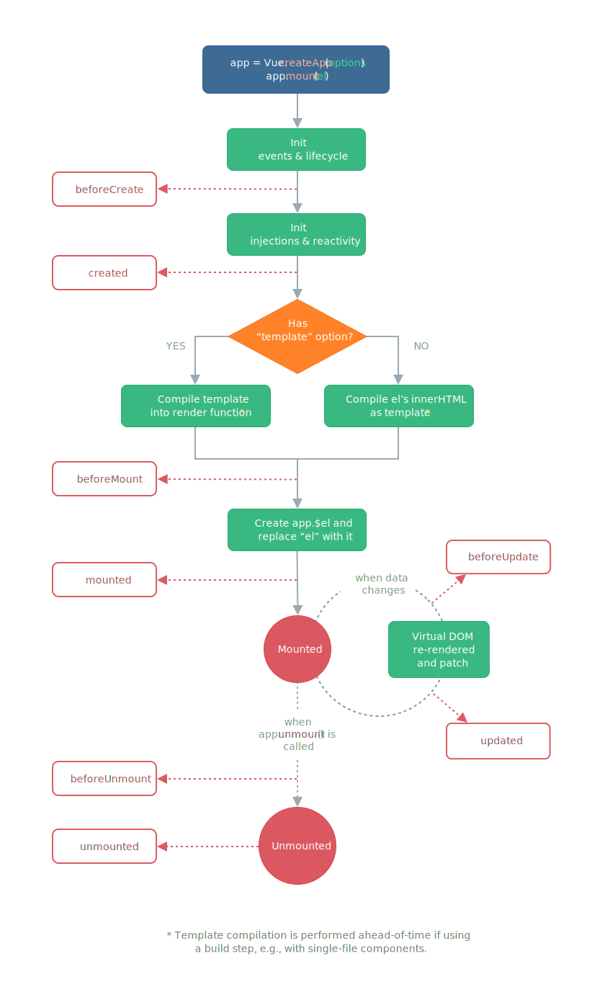
     + 模板语法，绑定数据（尤其要讲Attribute）⭐  
       Vue.js 使用了**基于 HTML** 的模板语法，允许开发者声明式地将 DOM 绑定至底层组件实例的数据。所有 Vue.js 的模板都是合法的 HTML，所以能被遵循规范的浏览器和 HTML 解析器解析。  
       在底层的实现上，Vue 将模板编译成**虚拟 DOM 渲染函数**。结合响应性系统，Vue 能够智能地计算出最少需要重新渲染多少组件，并把 DOM 操作次数减到最少。
       + 最简单，最基础的数据绑定形式就是在模板中通过**Mustache（双大括号）语法**进行文本插值的绑定（项目中基本没有，多数都是第三方包中进行的实现），给个官方示例
           
         上图通过一个双大括号语法将变量msg绑定到DOM中
       + 但更多的情况项目，项目里要求将一些变量绑定到HTML元素的attribute上，继而控制元素表达出想要的形式，这时Mustache语法不在起作用，而vue则提供了v-bind指令来将元素attribute和实例变量绑定，简单实例如下：  
         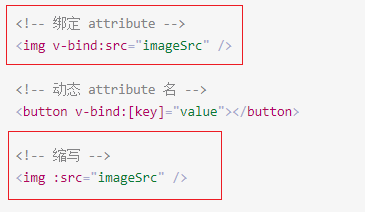  
         + 第一处，v-bind是vue指令，: 分隔符后的是html元素的attribute，= 后的表达式就是src attribute要绑定的实例变量名字，如此一来，这个img元素的图片地址可以在控制层灵活调整了
         + 第二处，v-bind指令简写为 :
         + 看一个批量绑定的例子，也是项目里比较常见的形式  
           
     + 指令和指令缩写⭐⭐  
       上一部分已经讲了v-bind绑定指令，及其简写和批量，vue中还有许多指令，如下是一些项目中使用较频繁的  
         
       + 项目中的列表渲染  
           
           
       + 事件监听  
         形式是 v-on:事件名="处理回调"  
         可以简写成 @事件名="处理回调"，在项目中简写形式比较常见
       + v-model双向绑定
         常用来在表单控件或者组件上创建双向绑定，贴出官方的讲解  
         [表单控件绑定](https://v3.cn.vuejs.org/guide/forms.html)  
         [组件 - 在输入组件上使用自定义事件](https://v3.cn.vuejs.org/guide/component-custom-events.html#v-model-%E5%8F%82%E6%95%B0)
     + 响应变化（计算/侦听属性、方法、侦听器）⭐  
       + 计算属性  
         碰到任何包含响应式数据的复杂逻辑，都可以使用计算属性渲染在DOM上  
         计算属性是放在组件computed选项对象中的一个函数成员（通常直接简写成函数形式），具有缓存效果
       + 方法  
         在组件method选项对象中添加的函数对象就是属于该实例的方法，通常用来作为事件监听的处理回调
       + 侦听器  
         放在实例的watch选项对象中  
         计算属性和侦听器都是用来处理响应式的数据，但当需要在数据变化时执行异步或开销较大的操作时，侦听器则更适合，但是！抛开侦听器的使用场景，计算属性比侦听器更应该广泛使用
     + 条件渲染、列表渲染（简单带过）  
     + 事件处理补述  
       在前面已经知道通过 v-on 指令或他的 @ 缩写可以在组件上监听事件，在实例的method选项中注册的函数可以作为事件处理回调。  
       官方提供了一些时间修饰符来对DOM事件进行处理，让开发者主要处理事件响应逻辑，比如  
         
       除此之外还提供了一些[键鼠系统相关的修饰符](https://v3.cn.vuejs.org/guide/events.html#%E5%86%85%E8%81%94%E5%A4%84%E7%90%86%E5%99%A8%E4%B8%AD%E7%9A%84%E6%96%B9%E6%B3%95)  
   + 组件精讲（创建&注册、数据传递（props单向下行））辅助理解UI库组件和表格库组件  
     + 自定义事件⭐⭐  
       通过自定义组件，可以摆脱元素原生事件、和框架事件的限制，使交互的形式更丰富  
       项目中如下:  
       + 先在子组件vxe-grid中触发show-picture事件  
           
       + 然后再父组件中捕捉，并获取数据进行利用  
         
     + 插槽(具名插槽及其缩写)  
       插槽，在vue这个组件式编程的环境下很常见，各个自定义组件的组合使用slot实现地更加便捷轻松，不过项目中直接定义插槽的场景很少，一般都是选择利用第三方组件库中定义好的更规范优雅的形式，其中最为广泛采用的是具名插槽，看一个vue官方的例子  
       + 定义具名插槽(该部分暴露一个名为base-layout的自定义组件)  
         

         >项目中并不会出现这种形式，因为第三方库，比如Element-Plus和Vxe-table已经定义了不少实用的插槽

       + 使用具名插槽（在base-layout组件中写入template，利用v-slot指令将内容插入定义好的具名插槽的位置）  
           

         >这种形式在项目中则会比较常见，就是再利用第三方提供的一些具名插槽

       + 具名插槽的缩写形式（尤为注意，项目里大多时候都采用缩写）  

         ```html
         <base-layout>
           <template #header> <!-- # 即 v-slot: 的缩写形式-->
             <h1>Here might be a page title</h1>
           </template>

           <template #default>
             <p>A paragraph for the main content.</p>
             <p>And another one.</p>
           </template>

           <template #footer>
             <p>Here's some contact info</p>
           </template>
         </base-layout>
         ```

     + keep-alive  
       对某些有动态数据具有渲染消耗的动态组件可以包裹一层\<keep-alive>\</keep-alive>组件进行保活，可以节省页面切换后重渲染带来的损耗，优化用户体验  
       比如：前一个tab页浏览到的位置，进行tab页切换后，还需要在当前位置，不能因为重渲染而丢失之前的浏览状态
     + 模板引用⭐⭐⭐  
       可以使用 ref attribute 为子组件或 HTML 元素指定引用 ID

       ```html
       <input ref="input" />
       ```

       项目中是下面这种用法(script中即渲染上下文中导出响应式变量root给模板使用，模板通过ref attribute 使用 root，这时root变量就相当于是div元素的响应式引用了)  

       ```html
       <template> 
         <div ref="root">This is a root element</div>
       </template>

       <script>
         import { ref, onMounted } from 'vue'

         export default {
           setup() {
             const root = ref(null)

             onMounted(() => {
               // DOM元素将在初始渲染后分配给ref
               console.log(root.value) // <div>这是根元素</div>
             })

             return {
               root
             }
           }
         }
       </script>
       ```

       项目中的例子  
         

   + [组合式API](https://v3.cn.vuejs.org/guide/composition-api-introduction.html#%E4%BB%80%E4%B9%88%E6%98%AF%E7%BB%84%E5%90%88%E5%BC%8F-api)  
     使用组合式API的目的是整理、重用、共享代码，并且减少单文件组件的体积，将公用的逻辑或配置提取到公共的文件中，各组件以导入的方式重新组织使用。  
     + setup()⭐⭐⭐  
       setup选项就是组合式API的入口，使用时间节点是创建组件之前，所以this关键字在这里不可用  
       项目中不乏对setup选项的使用，但还没真正实现组合式API的意义，代码重用较少，改进方式建议参考[官方案例](https://v3.cn.vuejs.org/guide/composition-api-introduction.html#setup-%E7%BB%84%E4%BB%B6%E9%80%89%E9%A1%B9)，逐渐将可重用代码提取到共用文件中
     + ref响应式变量⭐⭐⭐  
       前面的例子中已经通过 ref 创建过响应式变量，这里做讲解  
       ref 接受参数，并将其包裹在一个带有 value property 的对象中返回，然后可以使用该 property（value） 访问或更改响应式变量的值  
       但是，从 setup 返回的 refs 在模板中访问时是被自动解开的，因此不应在模板中使用 .value  
     + toRefs解构响应式对象，获取响应式属性  
       setup选项是可以接受两个参数的，其中一个是props，是响应式的，那想要解构props，使用其中的属性，同时又要维护props的响应性，就需要使用vue提供的toRefs  

       ```js
       import { toRefs } from 'vue'

       setup(props) {
         const { title } = toRefs(props)
         console.log(title.value)
       }
       ```

       另外，如果要使用props中某个可选属性（即不一定会存在），那用该使用toRef来代替  

       ```js
       import { toRef } from 'vue'
       setup(props) {
         const title = toRef(props, 'title')
         console.log(title.value)
       }
       ```

     + 生命周期钩子相关函数  
       通过vue暴露的一系列生命周期钩子函数，可以在setup配置某个生命周期的任务逻辑

       ```js
       export default {
         setup() {
           // mounted初次渲染时要进行的逻辑
           onMounted(() => {
             console.log('Component is mounted!')
           })
         }
       }
       ```

     + 计算属性&侦听  
       同理计算属性和侦听器也可以通过vue暴露的函数在组合式API中使用（通常是写在组件的选项property中）  
       函数分别是[computed](https://v3.cn.vuejs.org/api/computed-watch-api.html#computed)和[watch](https://v3.cn.vuejs.org/api/computed-watch-api.html#watch)  

   >至此，要上手该vue项目，所需要的vue知识都已经具备了，接下来需要了解项目所使用的两大部件

### 2、部队集结——认识Element-Plus、Vxe-Table

1. **[Element-Plus](https://element-plus.gitee.io/#/zh-CN/component/installation)**

   >网站快速成型工具  

    Element Plus，一套为开发者、设计师和产品经理准备的基于 Vue 3.0 的桌面端组件库
   + 使用Element有多种途径
     + 可以直接使用Element-Plus提供的[项目模块](https://github.com/element-plus/element-plus-starter)，快速着手开发
     + 或者通过vue-cli创建项目后添加Element-Plus插件（Element官方为新版的 vue-cli 准备了相应的 [Element Plus](https://github.com/element-plus/vue-cli-plugin-element-plus) 插件，你可以用它们快速地搭建一个基于 Element Plus 的项目。）
   + 了解一些UI组件（Element-UI的组件已经全局引入，所以可以直接使用）  
     1. **布局组件——Row、Col**  
        Element-Plus使用24栅栏规划更现代和表现一致的页面框架  
        使用24栅栏优化页面在不同分辨率大小的设备上的表现，例如项目中的侧边导航栏内容就是使用24栅栏布局进行排版  
        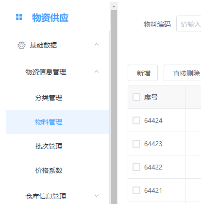  
        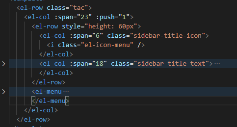  
        + 使用\<el-row>组件引入行布局，可通过原生style等属性配置元素样式等内容  
        + 使用\<el-col>组件引入栅格，并通过span属性配置占位23栅格，以及push配置偏移1栅格  

        >除此之外还有许多配置选项可以参照官网文档

     2. **布局组件——Container**  
        用于布局的容器组件，方便快速搭建页面的基本结构  
        项目中使用此布局容器搭建了页面主要结构  
        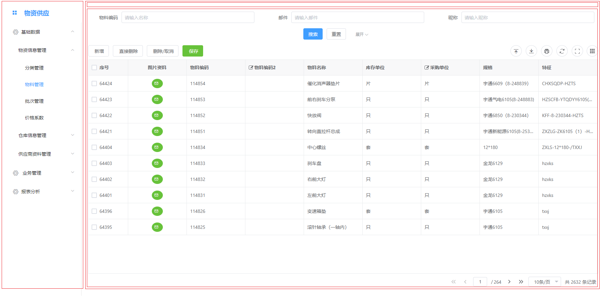
        页面表现上：大体为左右布局，左为侧边导航栏，右为页面主内容；主内容部分可在嵌入container，进而实现上下布局，上为面包屑导航（项目中已取消，因为目录层级不深，必要性不大），下为表格组件，具体实现如下：  
        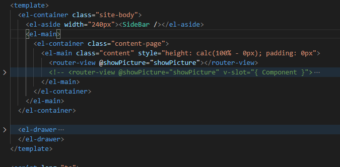  
        + 第一层通过\<el-container>引入布局容器
        + 第二层通过\<el-aside>和\<el-main>引入侧边布局和主内容布局，形成页面左右结构
        + 第三层\<el-main>中继续嵌入\<el-container>、\<el-main>，进行内部布局调整，可尝试在第三层中加入\<el-header>或\<el-footer>实现主内容部分的上下布局
     3. **抽屉**
        为了实现简约干净的交互感，物料图片采用抽屉收纳的形式，内部预览图同样采用24栅格布局  
        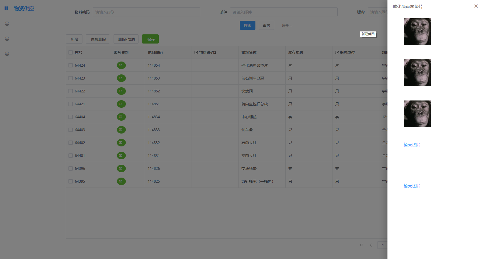  
        点击数据表中的附件按钮即可弹出抽屉，单击遮罩层即可关闭。  
        实现如下：  
          
        \<el-drawer>引入抽屉组件，通过title、direction、drawer等属性配置抽屉的标题、朝向、和开闭
     4. **大图预览**  
        图片采用提供大图预览功能的组件，给用户丰富饱满的交互感，具备：缩放、旋转、切换等常规功能  
        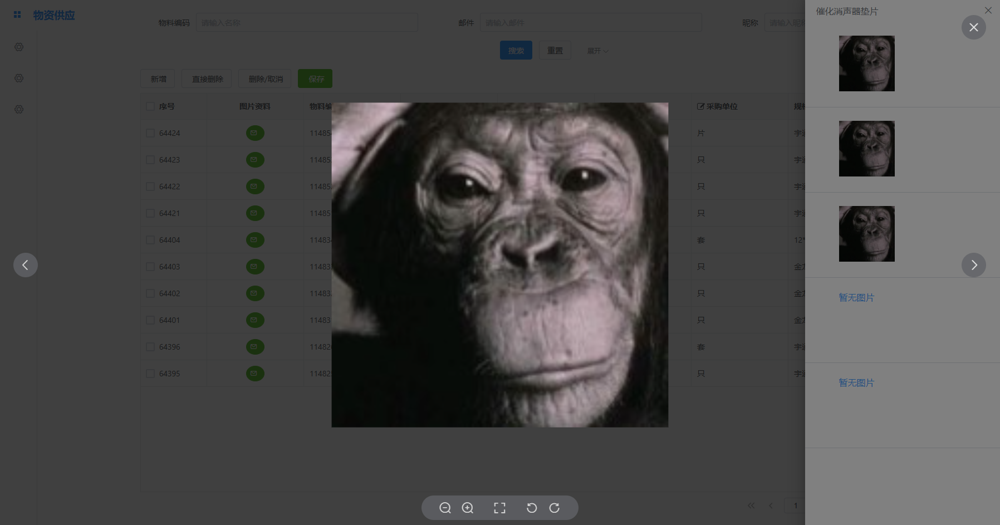  

   >Element-Plus 提供的组件还有许多，包括图标、按钮、过渡动效等等，可参考官方文档实现

2. **[Vxe-Table](https://xuliangzhan_admin.gitee.io/vxe-table/v4/table/grid/fullEdit)**

   >一个基于 vue 的 PC 端表格组件，支持增删改查、虚拟滚动、懒加载、快捷菜单、数据校验、树形结构、打印导出、表单渲染、数据分页、虚拟列表、模态窗口、自定义模板、渲染器、贼灵活的配置项、扩展接口等...

   1. **单刀直入**  
      vxe-table中vxe-grid组件是终极合并版，全部功能可配置、可自定义。  
      重点是在参考其高级表格的[完整功能](https://xuliangzhan_admin.gitee.io/vxe-table/v4/table/grid/fullEdit)的实例，并阅读vxe-grid的API配置文档，掌握其配置

   2. **API文档阅读**
      + 文档结构
        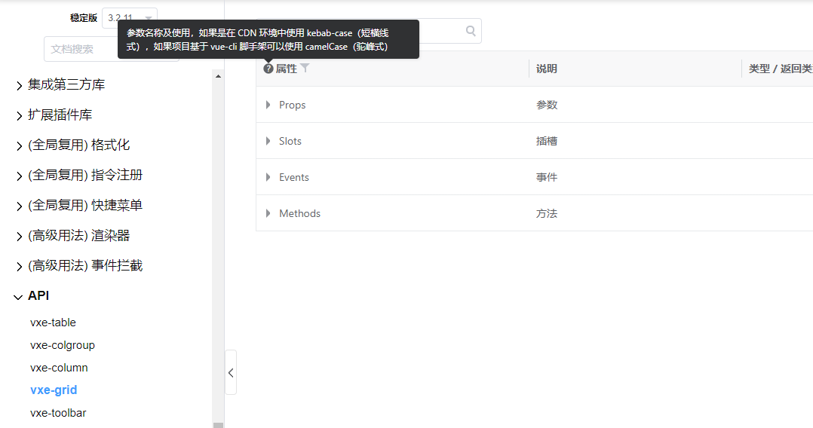

        >查阅文档首先注意页面提示，关于参数名称的说明  
        文档中全部参数采用kebab-case（短横线式）命名  
        CDN引入环境下可以这样直接使用，但是在vue-cli构建的项目中，需要转化为对应的camelCase（驼峰式）  
        例如max-height参数在使用时要替换成maxHeight

        文档整体分为四个部分
        + Props  
          该部分描述，配置出一个可用的高级表格需要哪些参数，这些参数全部可以 通过加入到一个配置对象的属性，来整合地传递给模板，渲染出需要的表格  
          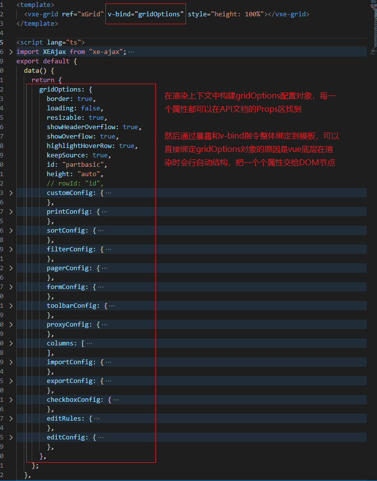
        + Slots  
          该部分描述了grid组件定义的具名插槽（关于具名插槽的使用见上文vue中具名插槽部分）  
          Props中有些部分也有关于slot的描述，用法相同
        + Events  
          该部分描述了表格组件定义的一些事件，可在模板中使用v-on指令（简写 @）进行监听
        + Methods  
          grid实例具备的功能，需要先通过模板引用获得组件实例，进而可调用其方法(展示一个调用表格实例的getCurrentRecord()函数获取高亮的当前行数据的操作)  
          
      + 常用参数配置
        这里关注一些配置表格常用的配置项
        1. columns，类型是一个数组，数组元素是列配置对象，对象可配置的属性有type列类型、title列标题等等更复杂的功能
        2. data，一个数组，表格的数据，但通常不使用这种形式，而是用下面的代理形式
        3. proxy-config（在代码中用对应驼峰式proxyConfig代替），一个对象，配置数据的代理器，参数有autoLoad自动加载、props解析响应体的结构、ajax代理配置（其中有四个选项，涵盖增删改查操作）
        4. pager-config（pagerConfig），分页工具配置
        5. form-config（formConfig），表单配置，**查询条件**就在这里
        6. toolbar-config（toolbarConfig），工具栏配置：增删改、导入导出、表格缩放、字段定制等按钮都在这里配置
3. **粘合剂——[vxe-table-plugin-element](https://github.com/x-extends/vxe-table-plugin-element)**  
   这里提这个粘合剂组件的意义是Element-Plus中有众多丰富的UI控件，通过使用该组件，可以在vxe-table中更好地嵌入Element-Plus的优秀控件，这里以物料的图片附件功能做展示：  
   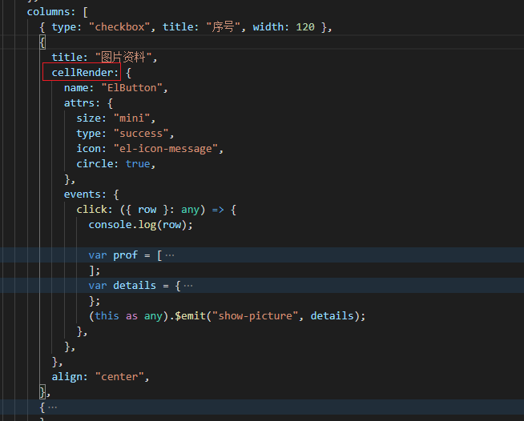  
   表格的列配置中有一个cellRender选项，可以配置渲染单元格的内容，但是vxe-table表格提供的渲染器只有input, textarea, select, $input, $select, $button, $buttons, $switch  
   这里可以通过粘合剂组件来加入Element-Plus中的图标按钮  
   + 要先在注册vxe-table时设置使用 vxe-table-plugin-element 组件，如图：  
     
   + 注册好之后就可以使用[组件文档](https://github.com/x-extends/vxe-table-plugin-element)中提供的Element-Plus的控件  
     配置参数在前面的截图中  
     1. name 属性声明要使用 “ElButton” 控件
     2. attrs 指 ElButton 的配置参数（可在 Element-plus 的按钮部分的文档中找到），这里给按钮配置了大小、形式、图标、和圆角
     3. events 指 ElButton 定义的自定义事件的处理回调（也可在 Element-plus 的按钮部分的文档中找到）  

   到这里为止，如何将Element-Plus和Vxe-Table相互兼容也讲解完毕。

   >总结一下，vue是新一代应用的开发环境，底层库、是在浏览器原生之上的一种优秀封装与开发，在vue的基础上又有许多方方面面的库可供使用，来构建一个优美强大的web应用，在这个项目中，Element-Plus 是 UI 框架，Vxe-Table是优秀的表格工具库。

## 二 · 项目意识

>从这里开始要针对本项目的开发，做相应补充

### 1、项目结构

在代码库的 [README](http://192.168.0.192/wangzexi/erp-frontend) 中做了较为完整的结构描述

### 2、工具选型

+ window下，要配置安装好 [nodejs环境](https://nodejs.org/dist/v14.16.1/node-v14.16.1-x64.msi) (这是14.16.1，长期支持版)
+ 安装 [yarn](https://repo.huaweicloud.com/yarn/v1.9.4/yarn-1.9.4.msi) 包管理工具，或者通过 npm 安装 yarn 包管理器 `npm i -g yarn`，**注意给 yarn仓库 配置华为镜像地址**
+ IDE推荐 VSCode ，对typescript有良好的支持

### 3、实施步骤（开发，调试，部署）

1. 克隆本项目的 dev 分支到本地  
   `git clone -b dev .........`  
   在dev分支上新建 XX-feature 分支进行特性开发（特性分支开发验证无误后本地合并回 dev 分支，一并上传git仓库）
2. 在项目根目录下执行 yarn install 安装依赖
3. 依赖安装好后严格遵守项目结构进行开发（可以先 yarn serve 启动项目，可以品尝热加载特性，实时修改实时验证）项目的启动端口可在根目录 package.json 文件第六行处修改配置，如需进行更多修改可以参考 [vue-cli文档](https://cli.vuejs.org/zh/guide/cli-service.html#vue-cli-service-serve)
4. 通过 yarn build 命令，可以打包出用于生产环境的 全部 bundle，产出在dist目录下
5. 生产环境的文件可通过nginx静态文件服务直接部署

## 三 · 比较ExtJS

### 1、ExtJS

1. ExtJS是比较老牌成熟的企业级web app框架
2. 内容涵盖ui视图、数据（store）、路由
3. 封装度比较高，体量大
4. namespace管理组件的概念（体制内）
5. 有明确的store概念，并且store和组件实例有较强的关联性，且管理比较集中
6. 为了解决动态数据展示，但实际项目中对大数据量的表格渲染还是略显差强人意
7. **它收费！**

### 2、VueJS

1. VueJS本身并没有ExtJS那么丰富，他只关注web应用的视图，只针对更加鲜活的视图提供能力
2. 但是Vue拥有活跃的生态，他的社区每天都有近百的包持续更新，且覆盖面广（工具类、UI类、底层方面）
3. 标签式、声明式、模板化地组件编程，更加灵活
4. vue本身对数据的限定不是很严苛，每个组件实例持有自己的property和state，维护组件数据时更直观简洁，如果外加vuex进行公共状态管理也可以达到体系化规范化的数据管理（所以灵活为先，强大为辅）
5. 最后是vue的渲染机制，底层实现了数据和视图的响应式绑定，不用过多的干涉，即可达到良好快速的页面响应效果，除此之外，更加智能的渲染逻辑，精确计算实际渲染范围（根据数据变化等），减少页面渲染损耗
6. 重构项目中选用的vxe-table，对于复杂结构数据和大量数据有较好的渲染性能，在千条数据的渲染下具有良好的性能，可有众多高度可配置功能，相较于ExtJs能提供更多可能性。
